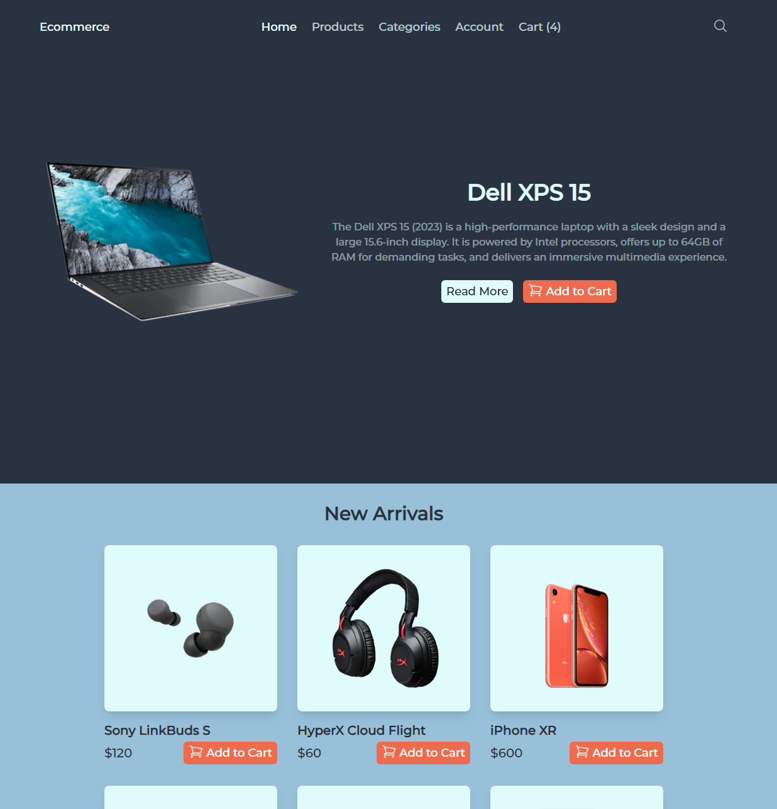
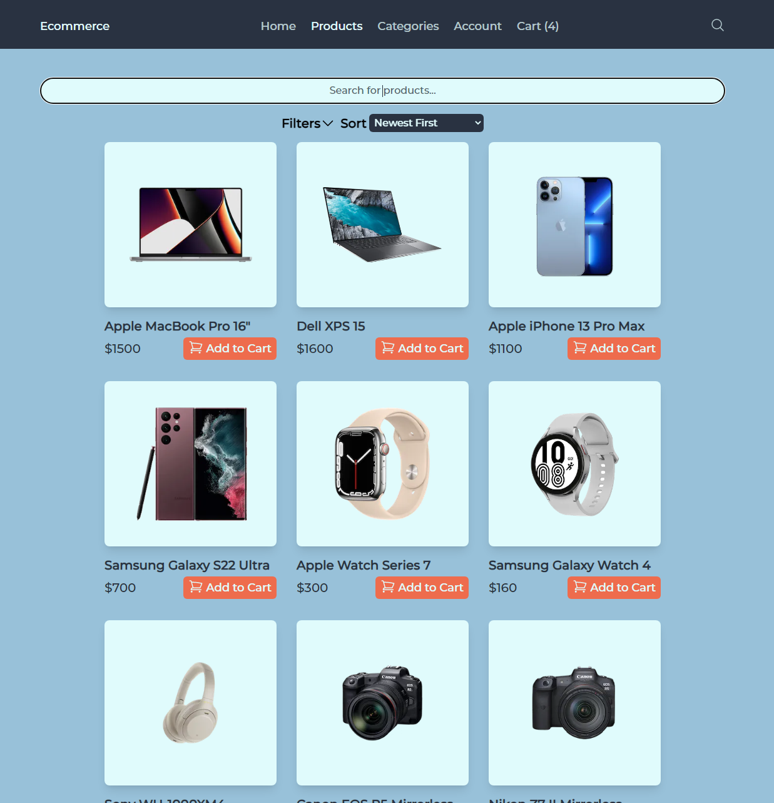
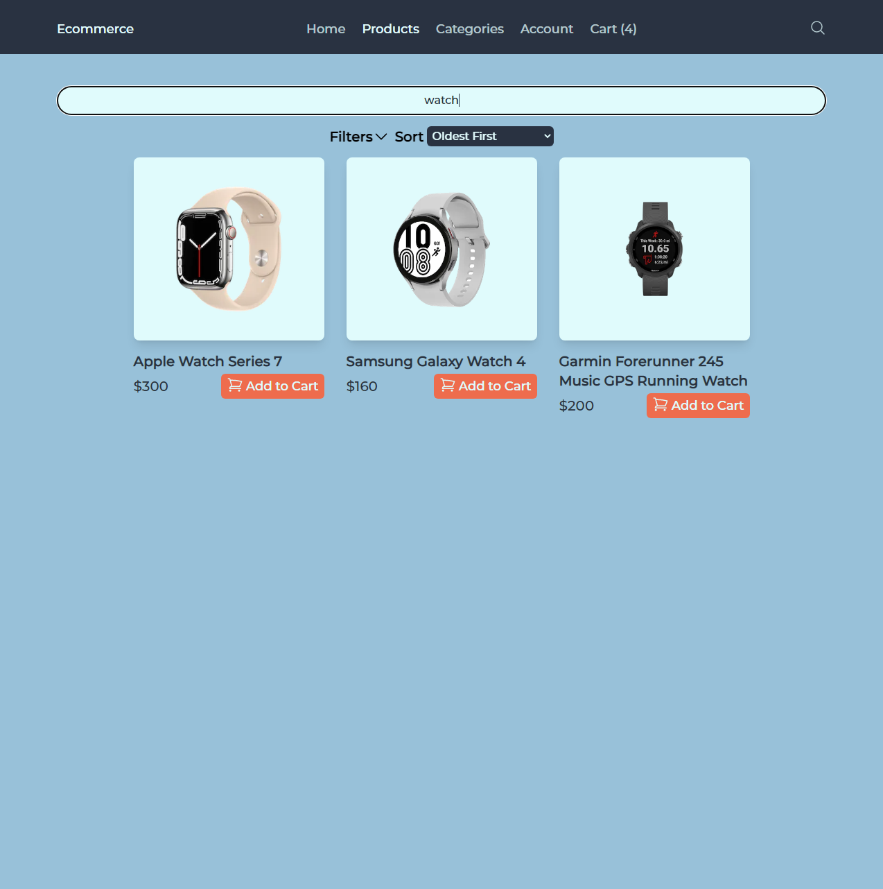
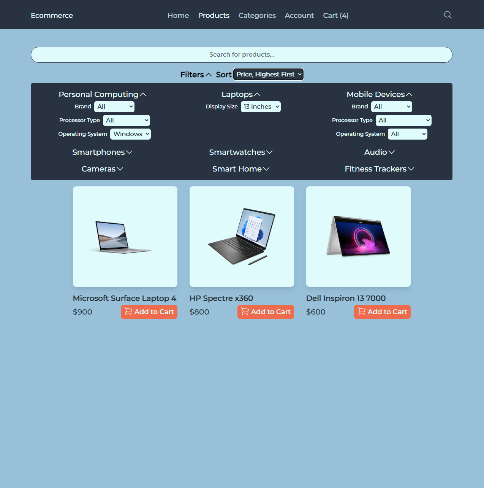
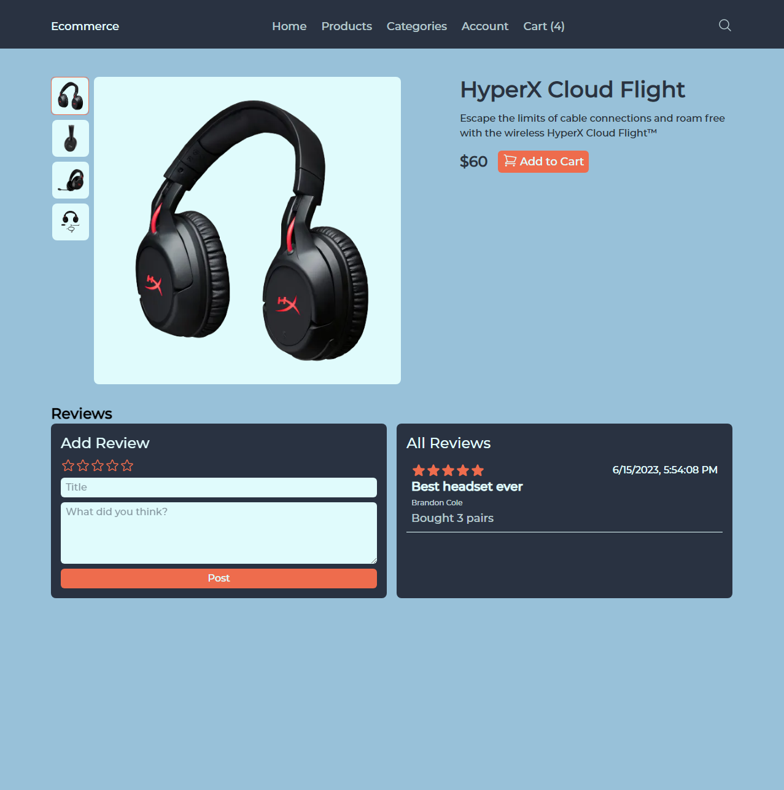
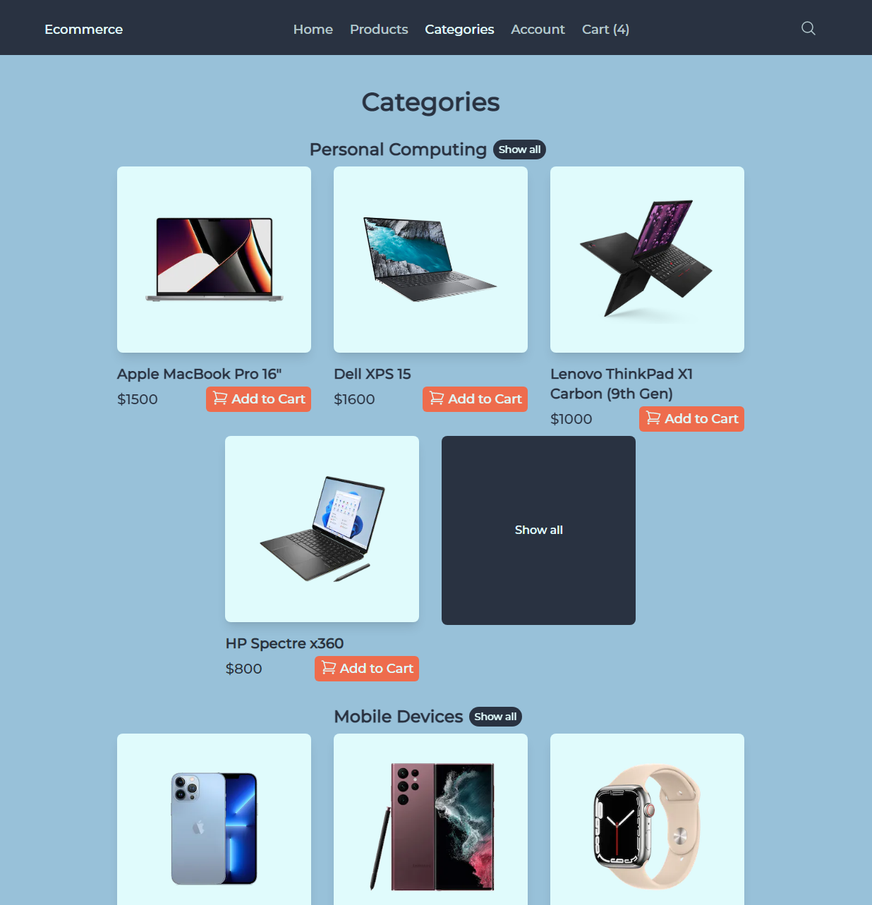
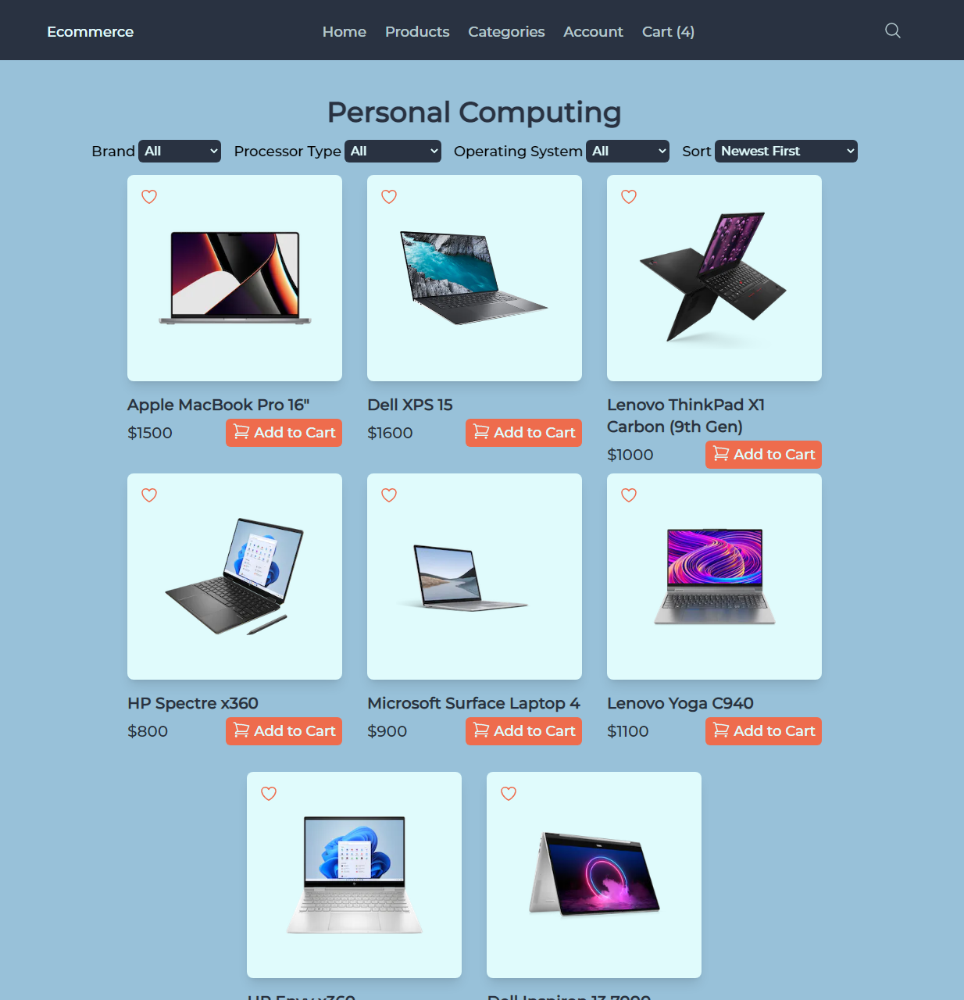
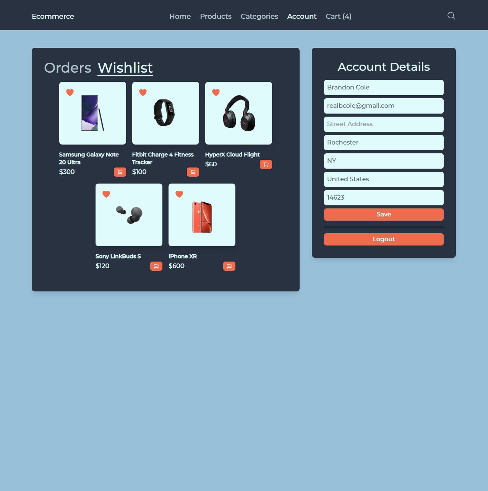
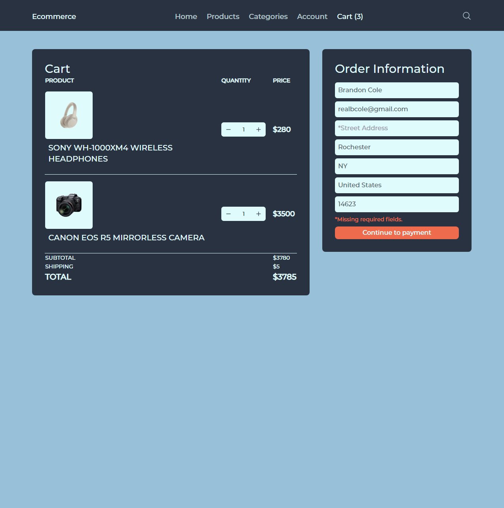
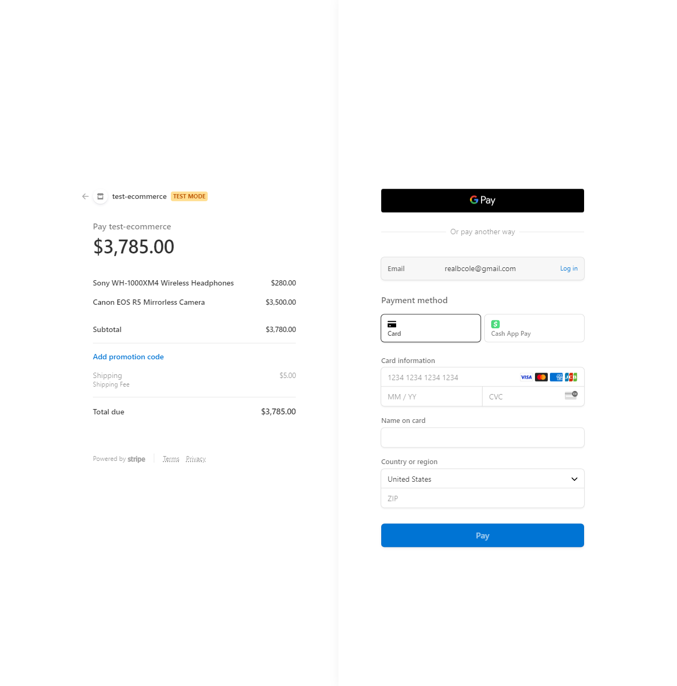

<h3 align="center">Custom Ecommerce Website</h3>

  <a href="https://ecommerce-front-eosin.vercel.app/">Live Demo</a>

---

 Custom Full Stack Ecommerce Website
      

## NOTE

Stripe is in test mode for this website, use test cards (https://stripe.com/docs/testing) to go through checkout.

## 📝 Table of Contents

- [About](#about)
- [Purpose](#purpose)
- [Built Using](#built_using)
- [Screenshots](#screenshots)
- [Credits](#credits)

## 🧐 About 

Full Stack Ecommerce Website, built from scratch, fully functional, customizable, fully responsive, connected to my ecommerce admin project (https://github.com/realbcole/ecommerce-admin)

## Screenshots & Features 

<h1>Features</h1>
<ul>
<li>Featured product display</li>
<li>New products grid</li>
<li>Add products to cart</li>
</ul>

<h1>Features</h1>
<ul>
<li>View all products</li>
<li>Add products to cart</li>
<li>Search products</li>
<li>Apply filters</li>
<li>Sort results</li>
</ul>

<h1>Features</h1>
<ul>
<li>Search for products by name, description, or category</li>
</ul>

<h1>Features</h1>
<ul>
<li>Filter by properties for each category</li>
</ul>

<h1>Features</h1>
<ul>
<li>Displays an individual product</li>
<li>Add product to cart</li>
<li>Add reviews, view existing reviews</li>
</ul>

<h1>Features</h1>
<ul>
<li>Displays all categories, up to 4 products in each, and a show all button for each</li>
<li>Add products to cart</li>
</ul>

<h1>Features</h1>
<ul>
<li>View all products in a category</li>
<li>Filter products, sort results</li>
<li>Add products to cart</li>
</ul>

<h1>Features</h1>
<ul>
<li>View Orders (not pictured)</li>
<li>View Wishlist</li>
<li>View/Set account details</li>
</ul>

<h1>Features</h1>
<ul>
<li>Add/Remove Products from cart</li>
<li>Set order details</li>
<li>Checkout</li>
</ul>

<h1>Features</h1>
<ul>
<li>Checkout with stripe</li>
<li>In test mode, you may checkout with test cards (https://stripe.com/docs/testing)</li>
</ul>

## ⛏️ Built Using 

- [React](https://react.dev/) - Web framework
- [NextJS](https://nextjs.org/) - Development framework
- [TypeScript](https://www.typescriptlang.org/) - Language
- [TailwindCSS](https://tailwindcss.com/) - Styling
- [Next-Reveal](https://next-reveal.vercel.app/) - Simple animations
- [Next-Auth](https://next-auth.js.org/) - User authentication
- [Stripe](https://stripe.com/docs) - Financial Services
- [NodeJs](https://nodejs.org/en/) - Server Environment
- [Axios](https://axios-http.com/docs/intro) - Backend HTTP Client
- [Mongoose](https://mongoosejs.com/) - Data Modeling
- [MongoDB](https://www.mongodb.com/) - Database
- [Vercel](https://vercel.com/docs) - Deployment
